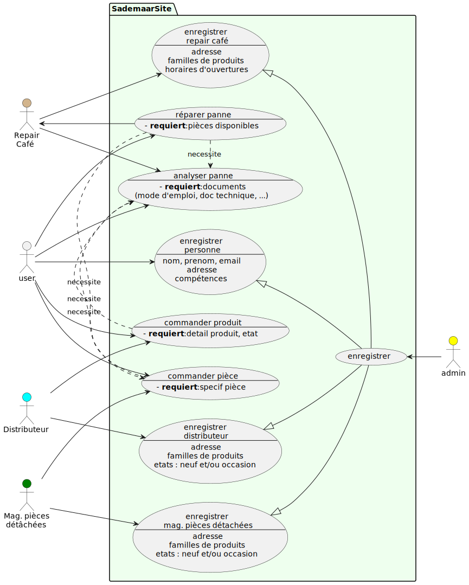
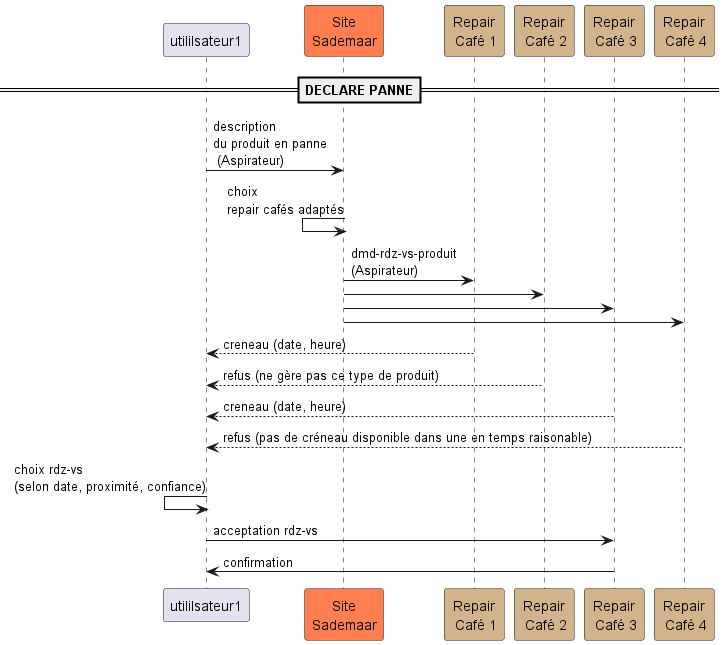
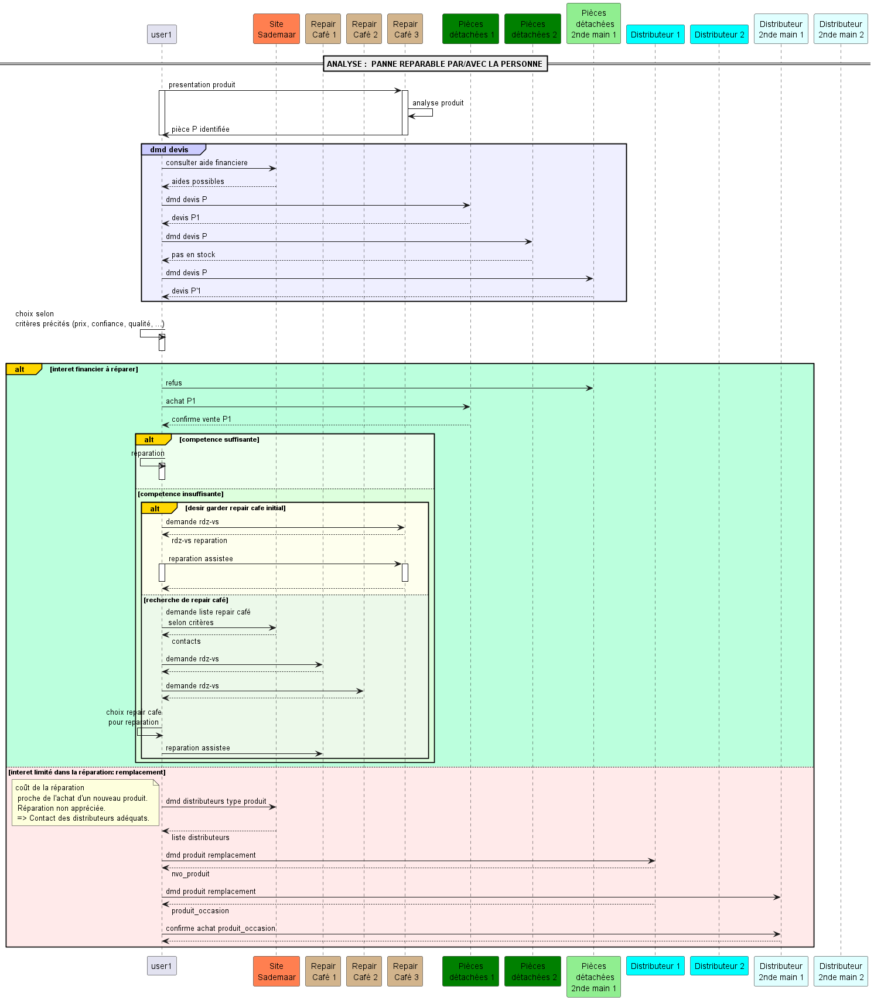
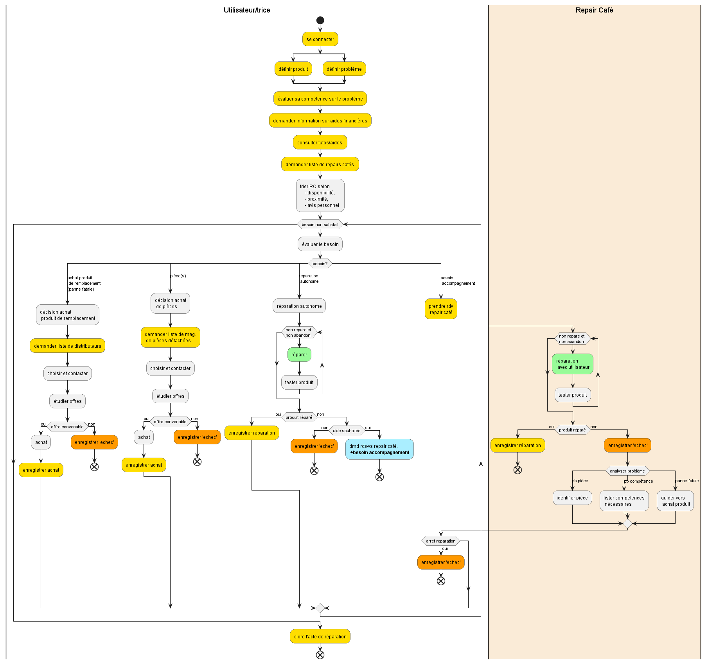

<meta name="description" content="Programming multi-agent in Java : use of an updated version of the Jade 
platform. Materials for Jade Tutorial : communication, protocols, votes, services, behaviors, ..." />

# SADéMMaR :
## Sensibilisation- Accompagnement et aide à la Décision des Ménages dans le processus de Maintenance et Réparation

----
Ce dépôt contient des codes pour des agents simulant des interactions dans le cadre de la réparation de produit.

Voici le scenario:
 - des utilisateurs possèdent des produits
 - des produits peuvent être en panne
 - plusieurs solutions sont disponibles :
   - tuto sur des website
   - repair cafés
   - distributeur de pièces de rechange
   - distributeurs.
---
### Use case
Voici le use case prévu pour la conception d'une application web de gestion des échanges.

---
### Specification

- Lorsque le produit ne fonctionne plus ; l'utilisateur essaie de trouver une aide : 
  - par lui-même, 
  - localement (repair coffee), 
  - en recherchant une pièce dans la liste des distributeurs de pièces, 
  - en remplaçant le produit.

- Le choix d'un repair café dépend de critères tels que le délai d'attente, la confiance, la position,...
- Le choix d'une pièce dépend également de critères tels que le coût, ...
- Le choix d'un distributeur dépend de la confiance et du prix

Très généralement, voici un diagrame de séquence pour la recherche de repair café : 

Voici les détails des interactions entre les différents acteurs : 

---
### Specification détaillée

Voici sous forme de diagramme d'activités l'ensemble du procédé inlut dans les codes fournis : 

---
### Implementation

Lancer la classe principale `LaunchAgents`:
- des produits types sont créés, ainsi que des pièces types.
- les agents SpareStore reçoivent des pièces aléatoirement et fixent chaucun leurs prix
- les agents Distributor reçoivent des produits aléatoirement et fixent chaucun leurs prix
- les agents RepairCoffee se voient attribuer des spécialités (des types de produits)
- les agents UserAgents reçoivent des produits

- Dans la fenêtre d'un user agent, on sélectionne un produit et on transmet une demande à un repair café.
- une panne est détectée sur une pièce, elle peut être légère ou lourde, voire dangereuse. 
---
